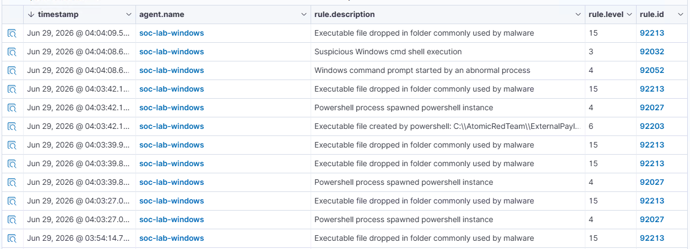

## ATT&CK ID: T1003

## Technique
OS Credential Dumping

## Tactic
Credential Access

### Command used

```powershell
Invoke-AtomicTest T1003 -TestNumbers 1
```

### Timestamp

Jun 29, 2026 - 04:04 AM

### Expected telemetry

- PowerShell process execution (`powershell.exe`)
- Execution of the **Gsecdump** credential dumping utility
- Process creation events for `gsecdump.exe`
- Access attempts to sensitive Windows credential data (e.g., LSASS)
- Wazuh alerts related to credential dumping or suspicious process execution
- Windows Event Logs and/or Sysmon events (if configured)

### Screenshot

