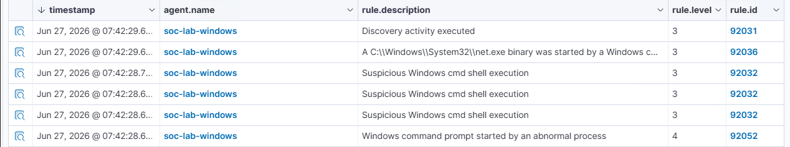

## ATT&CK ID: T1016
## Technique: System Network Configuration Discovery
## Tactic: Discovery

### Command used
Invoke-AtomicTest T1016 -TestNumbers 1 -PromptForInputArgs

### Timestamp
Jun 27, 2026  7:42 AM

### Expected telemetry
- PowerShell execution (`Invoke-AtomicTest`)
- Process creation events for network discovery commands (e.g., `ipconfig.exe`)
- Command Prompt (`cmd.exe`) execution
- Wazuh detection for Discovery activity
- Process creation events associated with `net.exe` and other network enumeration utilities

### Screenshot
