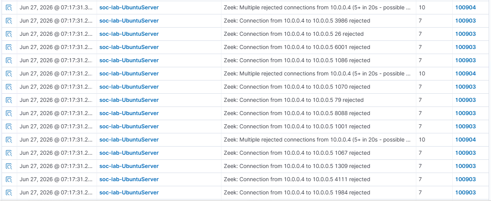

## ATT&CK ID: T1046
## Technique: Port Scan
## Tactic: Discovery

### Command used
Invoke-AtomicTest T1046 -TestNumbers 3 -PromptForInputArgs

### Timestamp
Jun 27, 2026  7:17 AM

### Expected telemetry
rule.id 100903: Connection from srcip to dstip dstport rejected
rule.id 100904: Multiple rejected connections from srcip (5+ in 20s - possible port scan activity)

### Screenshot

