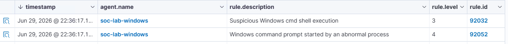

## ATT&CK ID: T1057

## Technique
Process Discovery

## Tactic
Discovery

### Command used

```powershell
Invoke-AtomicTest T1057 -TestNumbers 1
```

### Timestamp

Jun 29, 2026 - 10:36 PM

### Expected telemetry

- PowerShell process creation (`powershell.exe`)
- `cmd.exe` spawned by an abnormal parent process (PowerShell)
- Execution of `tasklist.exe` or similar process enumeration commands
- Windows command prompt started by unusual parent process
- Wazuh alerts related to suspicious cmd shell execution
- Sysmon process creation events showing the full parent-child chain

### Screenshot

