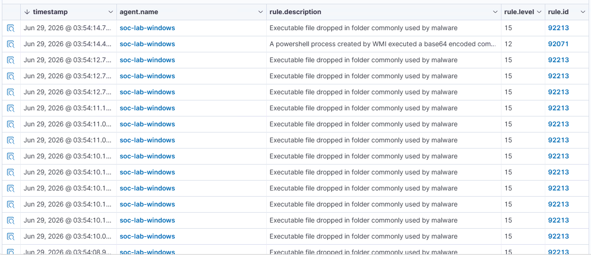

## ATT&CK ID: T1059.001

## Technique
PowerShell (Encoded PowerShell Commands)

## Tactic
Execution

### Command used

```powershell
Invoke-AtomicTest T1059.001 -TestNumbers 15
```

### Timestamp

Jun 29, 2026 - 03:54 AM

### Expected telemetry

- PowerShell (`powershell.exe`) process creation
- Execution of a Base64-encoded PowerShell command
- Windows Event Logs and/or Sysmon process creation events (if configured)
- Wazuh alerts related to encoded PowerShell execution
- Command-line arguments containing the `-EncodedCommand` parameter

### Screenshot
