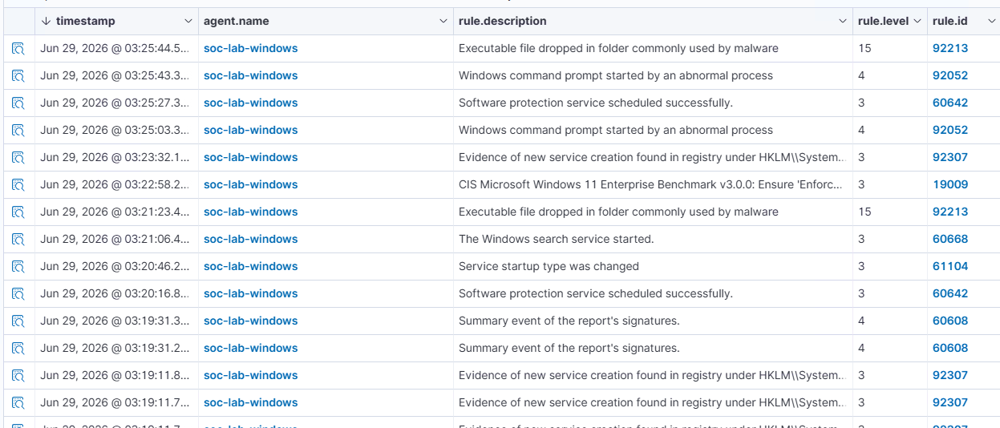

## ATT&CK ID: T1059.001

## Technique
PowerShell

## Tactic
Execution

### Command used

```powershell
Invoke-AtomicTest T1059.001 -TestNumbers 1
```

### Timestamp

Jun 29, 2026 - 03:25 AM

### Expected telemetry

- PowerShell process creation (`powershell.exe`)
- Execution of the Atomic Red Team PowerShell test
- Process creation events recorded by Windows Event Logs and/or Sysmon (if installed)
- Wazuh alerts related to PowerShell execution
- Parent-child process relationships showing PowerShell launched by Atomic Red Team

### Screenshot
