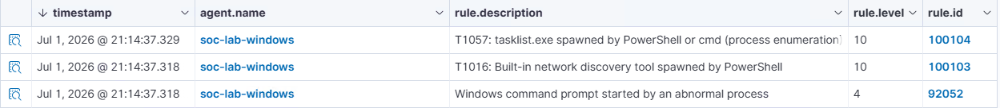

# Tuning: T1057 — Process Discovery (`tasklist.exe`)

| Field | Value |
|---|---|
| Rule | `100104` (`wazuh/local_rules.xml`) / `rules/T1057-process-discovery.yml` |
| ATT&CK ID | T1057 |
| Change type | Coverage gap fix (false negative) + documented false-positive tradeoff |
| Commit | `5189090` — "T1057: broaden parent detection to include cmd.exe" |
| Host | `soc-lab-windows` |

## Before

**Logic:** the rule fired only when `tasklist.exe` was spawned directly by `powershell.exe`.

```xml
<rule id="100104" level="10">
  <if_group>sysmon_event1</if_group>
  <field name="win.eventdata.image" type="pcre2">(?i)\\tasklist\.exe$</field>
  <field name="win.eventdata.parentImage" type="pcre2">(?i)\\powershell\.exe$</field>
  <description>T1057: tasklist.exe spawned by PowerShell (process enumeration)</description>
  ...
</rule>
```

**What happened when tested:** running `Invoke-AtomicTest T1057 -TestNumbers 1` did **not**
trigger rule `100104`. Screenshot below, taken 2026-07-01 20:57:00 UTC, shows the alerts that
*did* fire for that test run — `100103` (T1016 network discovery) and the generic
`92052`/`92032` shell-execution alerts — but no `100104`:


**Root cause:** Atomic Red Team's `tasklist.exe` execution does not spawn directly under
`powershell.exe`. It runs through an intermediary shell: `powershell.exe → cmd.exe →
tasklist.exe`. The rule's `parentImage` field only matched `powershell.exe`, so the actual
parent (`cmd.exe`) never matched — a **false negative**: the attack ran and was not detected.

## After

**Logic:** broadened the `parentImage` match to accept either `powershell.exe` or `cmd.exe`
as the immediate parent, in both the Sigma source and the Wazuh rule:

```yaml
# rules/T1057-process-discovery.yml
detection:
    selection:
        Image|endswith: '\tasklist.exe'
        ParentImage|endswith:
            - '\powershell.exe'
            - '\cmd.exe'
    condition: selection
```

```xml
<!-- wazuh/local_rules.xml -->
<rule id="100104" level="10">
  <if_group>sysmon_event1</if_group>
  <field name="win.eventdata.image" type="pcre2">(?i)\\tasklist\.exe$</field>
  <field name="win.eventdata.parentImage" type="pcre2">(?i)\\(powershell|cmd)\.exe$</field>
  <description>T1057: tasklist.exe spawned by PowerShell or cmd (process enumeration)</description>
  ...
</rule>
```

**Re-test result:** re-running the same Atomic test produced rule `100104` alongside
`100103` and `92052`, confirming the gap was closed. Screenshot taken 2026-07-01 21:14:37 UTC:



## The tradeoff this tuning accepted

Broadening the parent match from "only `powershell.exe`" to "`powershell.exe` or `cmd.exe`"
closes the false negative, but it also widens the rule's false-positive surface: `cmd.exe` is
the shell IT staff and end users reach for `tasklist` from directly and manually, far more
often than they'd reach for PowerShell to do the same thing. The Sigma rule's
`falsepositives` list was updated at the same time to reflect this explicitly:

```yaml
falsepositives:
    - PowerShell or cmd admin scripts that call tasklist.exe directly for inventory or monitoring purposes
    - IT automation tools invoking tasklist via PowerShell or cmd (e.g., SCCM, Ansible on Windows)
    - Helpdesk staff running tasklist from cmd.exe for troubleshooting
level: medium
```

The rule's severity was deliberately kept at `medium` (Wazuh level 10, not raised), so a
lone `tasklist.exe` launch from `cmd.exe` doesn't page anyone by itself — it is meant to be
read alongside the other alerts in the same process chain (`100103` network discovery,
`92052` abnormal shell parent), the same correlation pattern documented in
[`ir-reports/IR-001-T1003-CredentialDumping.md`](../ir-reports/IR-001-T1003-CredentialDumping.md).
Accepting a broader match here was judged worthwhile because a missed detection (silent gap)
is worse than an occasional low-severity alert an analyst can quickly dismiss as helpdesk
activity.

## Outcome

- False negative closed: T1057 via the `cmd.exe` intermediary path is now detected.
- New false-positive surface documented and accepted at `medium` severity rather than
  suppressed or ignored.
- Both the Sigma source (`rules/T1057-process-discovery.yml`) and the deployed Wazuh rule
  (`wazuh/local_rules.xml`, rule `100104`) were updated together so the two stay in sync.
